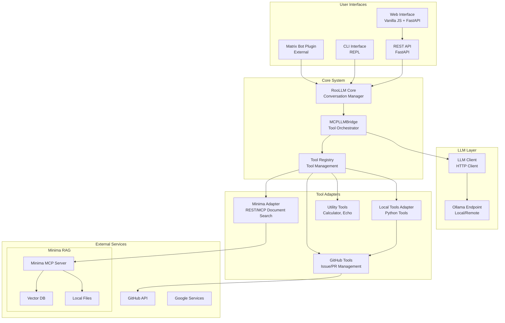

# RooLLM Architecture Documentation

## Executive AI Summary

RooLLM is a conversational AI assistant designed for Hypha Worker Coop, built on a modern MCP (Model Context Protocol) architecture that provides flexible tool integration and robust LLM communication. The system implements a sophisticated bridge architecture that separates concerns and enables extensibility through a plugin-based tool system.

## System Architecture Overview



## Core Components

### 1. RooLLM Core (`roollm.py`)

The central orchestrator that manages conversation flow and user interactions.

**Key Responsibilities:**
- Conversation management and history handling
- System prompt generation with contextual information (date/time, user context)
- User message processing and response formatting
- Error handling and graceful degradation
- Tool reaction callback management

**Architecture Pattern:** Facade pattern that provides a clean interface to the complex underlying system.

**Core Class Structure:**
```python
class RooLLM:
    def __init__(self, inference, config=None):
        self.inference = inference
        self.config = config or {}
        self.tool_registry = ToolRegistry()
        self.bridge = MCPLLMBridge(
            llm_client=inference,
            config=config,
            tool_registry=self.tool_registry,
            roollm=self
        )
    
    async def chat(self, user, content, history=[], react_callback=None):
        # Process user message through the bridge
        # Handle conversation flow and tool execution
        # Return formatted response
```

### 2. MCPLLMBridge (`bridge.py`)

The heart of the system that implements the Model Context Protocol bridge pattern.

**Key Responsibilities:**
- Tool registration and management across multiple adapters
- Message processing with tool calling support
- Adapter lifecycle management (connect; manual health checks)
- Tool execution orchestration
- Error handling and retry logic

**Architecture Pattern:** Bridge pattern that decouples the LLM from tool implementations.

**Message Processing Flow:**
```python
async def process_message(self, user, content, history, react_callback):
    # 1. Format messages and get tool descriptions
    # 2. Get initial LLM response with tool suggestions
    # 3. Process tool calls if present
    # 4. Get final LLM response with tool results
```

### 3. Tool Registry (`tools/tool_registry.py`)

Centralized tool management system that provides a unified interface for all available tools.

**Key Responsibilities:**
- Tool registration and discovery
- Schema validation and OpenAI format conversion
- Tool metadata management (name, description, parameters, emoji)
- Tool lookup and retrieval

**Architecture Pattern:** Registry pattern for centralized tool management.

**Tool Object Structure:**
```python
class Tool:
    def __init__(self, name: str, description: str, input_schema: Dict[str, Any], 
                 adapter_name: str = None, run_fn=None, emoji: Optional[str] = None):
        self.name = name
        self.description = description
        self.input_schema = input_schema
        self.adapter_name = adapter_name
        self.run_fn = run_fn 
        self.emoji = emoji
```

## Tool Adapter Architecture

### 1. Local Tools Adapter (`tools/local_tools_adapter.py`)

Dynamically loads and manages Python-based tools from the tools directory.

**Key Features:**
- Automatic tool discovery through file system scanning
- Dynamic module loading with error handling
- Tool metadata extraction (name, description, parameters, emoji)
- Integration with the main RooLLM instance
- Hot-reloading capability for development

**Tool Discovery Process:**
```python
async def connect(self, force=False):
    # Scan tools directory for .py files
    # Import modules and extract tool metadata
    # Create Tool objects and register them
    # Handle import errors gracefully
```

**Available Local Tools:**
- **GitHub Operations**: Issue/PR management, labeling, commenting
- **Utility Tools**: Calculator, echo, consensus analysis
- **Organizational Tools**: Holiday tracking, vacation management
- **LLM Management**: Model listing, current model queries

### 2. Minima REST Adapter (`minima_adapter.py`)

Connects to the Minima indexer/MCP server for local document search capabilities.

- Upstream project: [Minima (on‑premises conversational RAG with MCP)](https://github.com/dmayboroda/minima)

**Key Features:**
- REST/MCP-based communication with Minima server
- Connection health monitoring and retry logic
- Document search with source citation requirements
- Configurable server endpoints
- Automatic reconnection on failure

**Search Capabilities:**
- **File Formats**: PDF, CSV, DOCX, MD, TXT support
- **Source Citation**: Enforced citation requirements for all responses
- **Query Optimization**: Intelligent search result formatting
- **Connection Resilience**: Automatic retry with exponential backoff

### 3. GitHub Tools Integration

Comprehensive GitHub operations through dedicated tools and dispatchers.

**Available Operations:**
- **Issue Management**: Create, update, close, reopen, search
- **Pull Request Operations**: Create, merge, review, status updates
- **Label Management**: Add, remove, search, assignment
- **Comment Operations**: Post, search, contextual responses
- **Repository Operations**: Label discovery, issue/PR search

**Architecture Pattern:** Command pattern with dispatcher routing.

## LLM Integration Layer

### LLM Client (`llm_client.py`)

HTTP client for communicating with Ollama endpoints.

**Key Features:**
- Configurable base URLs and authentication
- Support for streaming and non-streaming responses
- Tool calling integration with OpenAI function format
- Error handling and logging
- Simple per-request HTTP session

**Client Configuration:**
```python
class LLMClient:
    def __init__(self, base_url: str, model: str, username: str = "", password: str = "", stream: bool = False):
        self.base_url = base_url.rstrip("/")
        self.model = model
        self.auth = aiohttp.BasicAuth(username, password) if username and password else None
        self.stream = stream
        self.logger = logging.getLogger(__name__ + ".LLMClient")
    
    async def invoke(self, messages: list, tools: Optional[list] = None, extra_options: Optional[dict] = None) -> dict:
        # Format payload for Ollama API
        # Handle authentication and HTTP communication
        # Parse and return response
```

**Tool Calling Support:**
- **OpenAI Function Format**: Converts tool registry to OpenAI-compatible format
- **Message Processing**: Handles tool calls and responses in conversation flow
- **Error Handling**: Graceful degradation when tools fail

## Configuration Management

### MCP Configuration (`mcp_config.py`)

Centralized configuration for MCP adapters and tool loading.

**Configuration Structure:**
```python
MCP_CONFIG = {
    "mcp_adapters": {
        "minima": {
            "mode": "inline",
            "env": {"MCP_ADAPTER": ".minima_adapter.MinimaRestAdapter"}
        },
        "local": {
            "mode": "inline", 
            "env": {"MCP_ADAPTER": ".tools.local_tools_adapter.LocalToolsAdapter"}
        }
    }
}
```

**Configuration Modes:**
- **Inline**: Direct Python module loading for development and simple deployments
- **Subprocess**: External process communication via stdio for isolation and security

**Environment Variables:**
- `MINIMA_MCP_SERVER_URL`: Minima indexer endpoint
- `USE_MINIMA_MCP`: Enable/disable Minima integration
- `ROO_LLM_URL`: Ollama endpoint URL
- `ROO_LLM_MODEL`: Default LLM model
- `GITHUB_TOKEN`: GitHub authentication token

## Interface Layer

### 1. Web Interface (`api/main.py`)

FastAPI-based web server providing modern web application capabilities.

**Features:**
- **RESTful Chat Endpoints**: Streaming and non-streaming chat responses
- **Session Management**: User session tracking and history persistence
- **CORS Support**: Cross-origin resource sharing for frontend integration
- **Authentication**: GitHub and Google service integration
- **Real-time Updates**: Server-sent events for live responses

**API Structure:**
```python
@app.post("/chat")
async def chat(request: ChatRequest):
    # Session management and chat processing with streaming
    # Event stream implementation for real-time responses
```

### 2. CLI Interface (`repl.py`)

Command-line interface for terminal-based interaction and automation.

**Features:**
- **Interactive Chat Mode**: Real-time conversation with RooLLM
- **Command-line Arguments**: Direct query execution for scripting
- **Tool Reaction Callbacks**: Visual feedback for tool execution
- **Session History**: In-session only; history resets on restart
- **Error Handling**: Graceful error messages and recovery

**CLI Structure:**
```python
async def main():
    """Main REPL loop for the RooLLM chat interface."""
    # Handle command line arguments or interactive mode
    # Chat processing with tool reaction callbacks
```

### 3. API Endpoints

**Core Endpoints:**
- `POST /chat`: Main chat interface with streaming support
- `POST /minima/query`: Direct Minima search queries
- `GET /models`: Available LLM models
- `GET /tools`: Registered tools

**Request/Response Models:**
```python
class ChatRequest(BaseModel):
    message: str
    session_id: str
    model: Optional[str] = None

class MinimaQueryRequest(BaseModel):
    query: str
    session_id: str
```

### 4. Matrix Interface (External to this codebase)

An external Matrix bot/plugin integrates with RooLLM.

**Features:**
- **Room Bridging**: Routes Matrix room messages to RooLLM and returns replies
- **Tool Access**: Exposes the same toolset
- **Auth & Safety**: Room restrictions and rate limiting handled in the plugin

Note: The Matrix integration lives outside this repository but is the primary user interface for RooLLM.

## Performance Characteristics

### Tool Execution
- **Local Tools**: In-process execution with minimal latency (<1ms overhead)
- **External Tools**: Subprocess communication with configurable timeouts (5-60s)
- **Network Tools**: HTTP-based with retry logic and connection pooling
- **Tool Chaining**: Sequential execution with result aggregation

### Memory Management
- **Tool Registry**: Lazy loading and caching of tool metadata
- **Session Management**: Configurable history limits and automatic cleanup
- **Connection Pooling**: Reuse of HTTP connections for external services
- **Resource Isolation**: Tool execution isolation through adapter boundaries

### Scalability Considerations
- **Stateless Design**: API endpoints designed for horizontal scaling
- **Async Architecture**: Non-blocking I/O for concurrent requests
- **Resource Isolation**: Tool execution isolation through adapter boundaries
- **Load Distribution**: Support for multiple LLM endpoints and tool adapters

## Security Architecture

### Authentication
- **GitHub**: App-based authentication with installation tokens and private key encryption
- **Google**: Service account credentials for Drive access with OAuth2
- **Ollama**: Basic authentication for remote endpoints with username/password

### Authorization
- **Tool Access**: Configurable tool availability per adapter and user role
- **API Security**: CORS configuration, rate limiting, and request validation
- **Data Isolation**: User session separation and automatic cleanup
- **Token Management**: Secure storage and rotation of authentication tokens

### Data Protection
- **Input Validation**: Schema-based validation for all tool parameters
- **Output Sanitization**: Safe handling of external data and responses
- **Audit Logging**: Comprehensive logging of all operations and access
- **Error Handling**: Secure error messages without information leakage

## Monitoring and Observability

### Logging
- **Structured Logging**: JSON-formatted logs with correlation IDs and timestamps
- **Tool Execution**: Detailed logging of tool calls, parameters, and responses
- **Performance Metrics**: Timing information for LLM calls and tool execution
- **Error Tracking**: Comprehensive error logging with stack traces and context

### Health Checks
- **Adapter Health**: Connection status monitoring for external services
- **Tool Availability**: Registry health and tool loading status
- **LLM Connectivity**: Endpoint availability and response time monitoring
- **Resource Usage**: Memory, CPU, and connection pool monitoring

### Metrics and Monitoring
- **Response Times**: LLM and tool execution latency tracking
- **Success Rates**: Tool execution success/failure ratios
- **Resource Utilization**: Memory and connection pool usage
- **User Activity**: Session counts and request volumes

## Future Architecture Directions

### Planned Enhancements
1. **Multi-Model Support**: Dynamic model switching and load balancing across multiple LLM providers
2. **Tool Composition**: Chaining and orchestration of multiple tools with dependency management
3. **Advanced Caching**: Semantic caching for repeated queries and result persistence
4. **Distributed Deployment**: Multi-instance deployment with shared state and load balancing

### Open Source Model Testing
1. **GPT-OSS Models**: Testing with various open source GPT implementations
2. **DeepSeek-R1**: Evaluation of DeepSeek's reasoning capabilities
3. **Qwen3**: Assessment of Alibaba's multilingual model performance
4. **Llama 3.1**: Testing Meta's latest open source model iteration
5. **Model Comparison Framework**: Systematic evaluation across different model families

### Benchmarking and Evaluation
1. **Comprehensive Benchmarking**: Building on the existing benchmarks branch work
   - Initial benchmarking framework with DeepEval integration
   - Tool calling accuracy and response quality metrics
   - Hallucination detection and performance benchmarks
2. **Evaluation Metrics**: 
   - Tool calling accuracy and reliability
   - Response quality and relevance
   - Hallucination detection and prevention
   - Performance benchmarks (latency, throughput)
3. **Prompt Engineering**: Systematic testing of different system prompts and user instructions
4. **Model Performance Tracking**: Continuous evaluation of model improvements and regressions
5. **Automated Testing**: CI/CD integration for model and prompt evaluation

### Integration Opportunities
1. **Vector Databases**: Enhanced document search and retrieval with semantic indexing
2. **Workflow Engines**: Complex multi-step task automation and business process management
3. **Monitoring Integration**: Prometheus metrics, Grafana dashboards, and alerting systems
4. **Event Streaming**: Real-time updates and notifications with WebSocket support

### Performance Optimizations
1. **Tool Result Caching**: Intelligent caching of tool results to reduce redundant calls
2. **Parallel Execution**: Concurrent tool execution where dependencies allow
3. **Connection Pooling**: Enhanced connection management for external services
4. **Memory Optimization**: Reduced memory footprint through lazy loading and cleanup

## Evolution and Git History

### Major Architectural Changes

#### 1. MCP Bridge Refactoring (April 2023)
**Commit:** `6ce0abe` - "Refactor/roollm ollama<>MCP bridge"
- **Changes:** 28 files, 514 insertions, 578 deletions
- **Impact:** Complete architectural overhaul from monolithic to bridge-based

**Key Improvements:**
- Separation of concerns between LLM and tools
- Introduction of MCPLLMBridge for tool orchestration
- Tool registry system for centralized management
- Adapter pattern for different tool types

#### 2. Bridge Delegation (April 2023)
**Commit:** `4115e22` - "refactor RooLLM to delegate tool logic to MCPLLMBridge"
- **Changes:** 1 file, 52 insertions, 168 deletions
- **Impact:** RooLLM core simplified to focus on conversation management

**Before vs After:**
```python
# Before: Monolithic tool handling
class RooLLM:
    def __init__(self, inference, tool_list, config):
        self.tools = Tools(tool_list, config)
        # Direct tool management
    
    async def chat(self, user, content, history):
        # Direct tool calling logic

# After: Bridge delegation
class RooLLM:
    def __init__(self, inference, config):
        self.bridge = MCPLLMBridge(...)
        # Tool logic delegated to bridge
    
    async def chat(self, user, content, history):
        # Bridge handles tool orchestration
```

#### 3. Hybrid Adapter Architecture (April 2023)
**Commit:** `17572a6` - "replaces subprocess-only architecture with hybrid inline / subprocess loader"
- **Impact:** Support for both inline Python modules and external subprocess tools

### Architectural Principles

1. **Separation of Concerns**: Clear boundaries between conversation management, tool execution, and LLM communication
2. **Extensibility**: Plugin-based tool system with adapter pattern
3. **Fault Tolerance**: Graceful degradation and error handling at multiple levels
4. **Configuration-Driven**: Flexible adapter configuration without code changes
5. **Standards Compliance**: MCP protocol adherence for tool integration

## Conclusion

RooLLM represents a modern, extensible architecture for conversational AI systems. The MCP bridge pattern provides a clean separation between LLM capabilities and tool execution, while the adapter system enables flexible integration with various external services. The architecture successfully balances simplicity for common use cases with the flexibility needed for complex integrations, making it suitable for both development and production environments.

The comprehensive tool ecosystem, combined with robust error handling and monitoring, provides a solid foundation for AI-assisted organizational workflows. The system's evolution from a monolithic design to a bridge-based architecture demonstrates its commitment to maintainability and extensibility, positioning it as a robust platform for future enhancements and integrations.

The architecture's focus on standards compliance, performance optimization, and security makes it well-suited for enterprise deployment while maintaining the flexibility needed for rapid prototyping and development.
